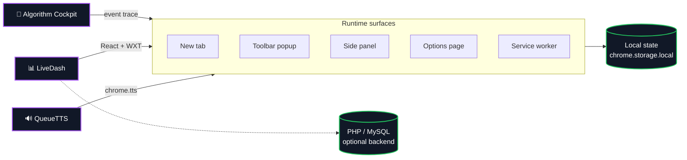

  

  

---

## 👋 About

I'm Mahan — founder of **GreenTouch**, studying CS with a side focus on AI. Most of what I build runs entirely in the browser: no backend, no accounts, local storage only.

The things I keep coming back to are surfaces people hit constantly — a new tab page, selected text, an algorithm you want to actually *see* step through. Keep the action count low, keep the data local.

 

---

### 🧭 Algorithm Cockpit &nbsp;·&nbsp; <a href="https://mahan-imanian.github.io/ML-Algorithm-Visualizer/">Live Demo →</a>

An in-browser tool for stepping through **pathfinding** and **sorting** algorithms event by event. Draw a grid, drop walls and weighted terrain, pick an algorithm, and watch the frontier, visited cells, and current node evolve — or drag the scrubber back to compare any two states in a run.

Most visualizers just play through an animation. This one records the full run as an event log you can move through freely: pause anywhere, step forward or back one event at a time, and read the live state panel and pseudocode alongside it. Runs export as JSON. **No install, no build step.**

  
  
  
  

<table>
  <tr>
    <td width="50%" valign="top">
      <h3><a href="https://github.com/Mahan-Imanian/LiveDash">📊 LiveDash</a></h3>
      
A <b>new-tab replacement</b> with animated frosted-glass widgets: calendar, notes, todos, bookmarks, weather, news, translation, and currency.

      
Chrome MV3 extension built with <b>React, TypeScript, Tailwind, WXT, and Workbox</b>. Local fallback data keeps the UI rendering offline. Ships a Google sign-in flow and a MySQL/PHP backend starter if you need server-side state.

      

         
        
        
      

      

    </td>
    <td width="50%" valign="top">
      <h3><a href="https://github.com/Mahan-Imanian/QueueTTS">🔊 QueueTTS</a></h3>
      
A <b>text-to-speech queue</b> for the browser. Select text on any page — or let it pull the full readable content — add it to a queue, and play it back later through Chrome's built-in speech engine.

      
Chrome MV3, Chrome 116+. Uses <code>chrome.storage.local</code> for the queue, the <code>tts</code> API for playback, context-menu capture, and a side panel for full queue management, plus popup, options, and background-worker surfaces.

      

         
        
        
      

      

    </td>
  </tr>
</table>

---

 

---

## 🧩 How these tools are built

Every project shares the same spine: a Chrome Manifest V3 surface set, client-side state, and zero required backend.

---

Everything here runs entirely in the browser.

