```mermaid
flowchart TB
  Chrome["Chrome"] --> Manifest["manifest.json"]

  Manifest --> Popup["Toolbar popup"]
  Manifest --> SidePanel["Side panel"]
  Manifest --> Options["Options page"]
  Manifest --> Worker["Background service worker"]
  Manifest --> Storage[("chrome.storage.local")]

  QueueTTS["QueueTTS"] --> QPopup["pages/popup.html"]
  QueueTTS --> QPanel["pages/sidepanel.html"]
  QueueTTS --> QOptions["pages/options.html"]
  QueueTTS --> QWorker["src/background.js"]
  QueueTTS --> QTTS["chrome.tts"]
  QueueTTS --> QMenus["contextMenus"]

  LiveDash["LiveDash"] --> LNewTab["newtab.html"]
  LiveDash --> LPopup["popup.html"]
  LiveDash --> LPanel["sidepanel.html"]
  LiveDash --> LOptions["options.html"]
  LiveDash --> LWorker["background.js"]
  LiveDash --> LBookmarks["chrome.bookmarks"]

  QPopup --> Storage
  QPanel --> Storage
  QOptions --> Storage
  QWorker --> Storage
  LNewTab --> Storage
  LPopup --> Storage
  LPanel --> Storage
  LOptions --> Storage
  LWorker --> Storage

  classDef core fill:#0d1117,stroke:#38bdf8,color:#ffffff,stroke-width:2px;
  classDef project fill:#111827,stroke:#a855f7,color:#ffffff,stroke-width:2px;
  classDef file fill:#111827,stroke:#22c55e,color:#ffffff,stroke-width:2px;
  classDef api fill:#111827,stroke:#f97316,color:#ffffff,stroke-width:2px;

  class Chrome,Manifest core;
  class QueueTTS,LiveDash project;
  class Popup,SidePanel,Options,Worker,QPopup,QPanel,QOptions,QWorker,LNewTab,LPopup,LPanel,LOptions,LWorker file;
  class Storage,QTTS,QMenus,LBookmarks api;
```

<div align="center">


<br><br>


<br><br>

<a href="https://github.com/Mahan-Imanian/QueueTTS">
  
</a>
<a href="https://github.com/Mahan-Imanian/LiveDash">
  
</a>
<a href="https://www.linkedin.com/in/mahan-imanian">
  
</a>

<br><br>


<br><br>


</div>

---

## What I build

I build Chrome Manifest V3 extensions that run without accounts or a backend.

The current projects use `chrome.storage.local`, toolbar popups, side panels, options pages, background service workers, keyboard shortcuts, and extension-local scripts. The goal is simple: capture or organize browser data locally, then make it reachable in one or two actions.

---

<div align="center">


</div>

<table>
  <tr>
    <td width="50%" valign="top">
      <h2>
        <a href="https://github.com/Mahan-Imanian/QueueTTS">QueueTTS</a>
      </h2>
      <p>
        Chrome MV3 extension for saving selected text or readable page text into a local playback queue.
      </p>
      <p>
        It uses <code>chrome.storage.local</code> for queue/settings data, Chrome's <code>tts</code> API for playback, context-menu actions for capture, and a side panel for queue management.
      </p>
      <p>
        <b>Source version:</b> 2.4.0<br>
        <b>Chrome target:</b> Manifest V3, Chrome 116+<br>
        <b>Distribution:</b> source repo, load unpacked
      </p>
      <p>
        <a href="https://github.com/Mahan-Imanian/QueueTTS">
          
        </a>
      </p>
      <p>
        
        
        
      </p>
    </td>
    <td width="50%" valign="top">
      <h2>
        <a href="https://github.com/Mahan-Imanian/LiveDash">LiveDash</a>
      </h2>
      <p>
        Chrome MV3 extension that replaces the new tab page with a local dashboard.
      </p>
      <p>
        It uses <code>newtab.html</code> for the dashboard, <code>chrome.storage.local</code> for dashboard state, the bookmarks permission for bookmark widgets, plus popup, side-panel, options, and background-worker surfaces.
      </p>
      <p>
        <b>Source version:</b> 14.0.1<br>
        <b>Chrome target:</b> Manifest V3<br>
        <b>Distribution:</b> source repo, build/package scripts included
      </p>
      <p>
        <a href="https://github.com/Mahan-Imanian/LiveDash">
          
        </a>
      </p>
      <p>
        
        
        
      </p>
    </td>
  </tr>
</table>

---

## Product proof

<table>
  <tr>
    <th align="left">Project</th>
    <th align="left">Runtime surface</th>
    <th align="left">File / manifest entry</th>
    <th align="left">Purpose</th>
  </tr>
  <tr>
    <td>QueueTTS</td>
    <td>Toolbar popup</td>
    <td><code>pages/popup.html</code></td>
    <td>Capture, playback controls, queue preview, command entry</td>
  </tr>
  <tr>
    <td>QueueTTS</td>
    <td>Side panel</td>
    <td><code>pages/sidepanel.html</code></td>
    <td>Full queue management</td>
  </tr>
  <tr>
    <td>QueueTTS</td>
    <td>Options page</td>
    <td><code>pages/options.html</code></td>
    <td>Voice, playback, pronunciation, storage, privacy, shortcut settings</td>
  </tr>
  <tr>
    <td>QueueTTS</td>
    <td>Background worker</td>
    <td><code>src/background.js</code></td>
    <td>Extension events, context menus, capture flow, TTS coordination</td>
  </tr>
  <tr>
    <td>QueueTTS</td>
    <td>Validator</td>
    <td><code>scripts/check.mjs</code></td>
    <td>Manifest, required files, assets, syntax, remote references, placeholder checks</td>
  </tr>
  <tr>
    <td>LiveDash</td>
    <td>New tab</td>
    <td><code>newtab.html</code></td>
    <td>Main dashboard override</td>
  </tr>
  <tr>
    <td>LiveDash</td>
    <td>Toolbar popup</td>
    <td><code>popup.html</code></td>
    <td>Quick actions</td>
  </tr>
  <tr>
    <td>LiveDash</td>
    <td>Side panel</td>
    <td><code>sidepanel.html</code></td>
    <td>Side-panel workflow</td>
  </tr>
  <tr>
    <td>LiveDash</td>
    <td>Options page</td>
    <td><code>options.html</code></td>
    <td>Dashboard settings</td>
  </tr>
  <tr>
    <td>LiveDash</td>
    <td>Background worker</td>
    <td><code>background.js</code></td>
    <td>Extension event handling</td>
  </tr>
  <tr>
    <td>LiveDash</td>
    <td>Validator</td>
    <td><code>scripts/validate-extension.js</code></td>
    <td>Manifest, required pages, CSP, local assets, runtime file checks</td>
  </tr>
</table>

---

<div align="center">


</div>



---

## QueueTTS

QueueTTS is built around one workflow: capture text, keep it local, and play it later.

### User flow

```text
Select text or open a readable page
→ Right-click or open the toolbar popup
→ Add text to QueueTTS
→ Review the queue in the side panel
→ Play through Chrome text-to-speech
→ Adjust voice, speed, pitch, volume, shortcuts, and pronunciation rules in options
```

### What is implemented

* Selected-text capture
* Current-page capture
* Paste-based capture
* Queue preview in popup
* Full queue in side panel
* Playback deck
* Search and filters
* Failed extraction repair flow
* Focus mode
* Import/export
* Local privacy controls
* Structured pronunciation rule editor
* Voice preview controls
* Keyboard shortcut reference
* Command palette entry with `Ctrl/⌘ K`

### Development

```bash
git clone https://github.com/Mahan-Imanian/QueueTTS.git
cd QueueTTS
npm install
npm run check
npm run build
```

Expected validator success output:

```text
QueueTTS extension checks passed.
```

### Load unpacked

```text
chrome://extensions
→ Developer mode
→ Load unpacked
→ select the QueueTTS folder
→ pin QueueTTS from the Chrome toolbar
```

---

## LiveDash

LiveDash replaces Chrome's new tab page with a local dashboard.

### User flow

```text
Open a new tab
→ Use the dashboard for search, bookmarks, tasks, notes, focus sessions, and quick links
→ Open popup for quick actions
→ Open side panel for secondary workflow
→ Adjust settings from the options page
```

### What is implemented

* `newtab.html` dashboard override
* Popup quick actions
* Side-panel workflow
* Options/settings page
* Background service worker
* Local dashboard state
* Bookmark widgets through Chrome bookmarks permission
* Local city-time / world-clock formatting fixes in v14.0.1
* Package validation before ZIP creation

### Development

```bash
git clone https://github.com/Mahan-Imanian/LiveDash.git
cd LiveDash
npm install
npm run check
npm run build
npm run package
```

Expected validator success output:

```text
LiveDash extension validation passed.
```

### Load unpacked

```text
chrome://extensions
→ Developer mode
→ Load unpacked
→ select the LiveDash folder
→ open a new tab
```

---

## Permissions

### QueueTTS

| Permission     | Why it is used                                                                           |
| -------------- | ---------------------------------------------------------------------------------------- |
| `storage`      | Stores queue items, playback settings, pronunciation rules, and local preferences.       |
| `contextMenus` | Adds right-click actions for selected text, current-page capture, and opening the queue. |
| `activeTab`    | Reads the current tab after the user invokes capture.                                    |
| `scripting`    | Runs capture logic against the active tab when needed.                                   |
| `sidePanel`    | Opens the full queue surface in Chrome's side panel.                                     |
| `tts`          | Plays queue items through Chrome text-to-speech.                                         |
| `alarms`       | Supports timed/background extension behavior such as playback-related scheduling.        |

### LiveDash

| Permission  | Why it is used                                             |
| ----------- | ---------------------------------------------------------- |
| `storage`   | Stores dashboard state locally.                            |
| `bookmarks` | Reads bookmarks for bookmark-related dashboard widgets.    |
| `activeTab` | Supports quick actions tied to the active browser context. |
| `sidePanel` | Opens side-panel workflows.                                |

---

## Validation

These repos use validation scripts instead of a full browser test suite.

| Project  | Command           | What it checks                                                                                                                                           |
| -------- | ----------------- | -------------------------------------------------------------------------------------------------------------------------------------------------------- |
| QueueTTS | `npm run check`   | MV3 shape, required files, required permissions, missing assets, remote references, placeholder markers, JavaScript syntax, broken page asset references |
| QueueTTS | `npm run build`   | Runs the same validation path as `npm run check`                                                                                                         |
| LiveDash | `npm run check`   | JavaScript syntax checks, MV3 structure, required extension pages, CSP safety, local asset requirements, runtime file checks                             |
| LiveDash | `npm run build`   | Runs `npm run check`                                                                                                                                     |
| LiveDash | `npm run package` | Runs validation, then creates a ZIP package                                                                                                              |

---

## Current status

| Item                        | QueueTTS                | LiveDash                |
| --------------------------- | ----------------------- | ----------------------- |
| Source version              | `2.4.0`                 | `14.0.1`                |
| Manifest version            | MV3                     | MV3                     |
| Chrome Web Store link       | Not linked              | Not linked              |
| GitHub releases             | Not published here      | Not published here      |
| Install path                | Load unpacked           | Load unpacked           |
| Data model                  | Local extension storage | Local extension storage |
| Backend required            | No                      | No                      |
| Account required            | No                      | No                      |
| Screenshots in this profile | Not added yet           | Not added yet           |
| Demo GIF in this profile    | Not added yet           | Not added yet           |

---

## Recent maintenance notes

### QueueTTS 2.4.0

* Reworked the settings page into an operational configuration surface.
* Added a live status strip for voice, queue, storage, and local privacy state.
* Added sticky settings navigation.
* Added structured pronunciation rules with inline add, edit, delete, and test actions.
* Added voice preview controls and live range values.
* Reframed permissions as rows with why-needed explanations.
* Moved destructive reset actions into a separated danger zone.

### LiveDash 14.0.1

* Fixed a new-tab crash caused by a missing world-clock time formatter.
* Added safer local city-time formatting for clock widgets.
* Revalidated the extension package and generated a fixed v14 ZIP.

---

## Troubleshooting

| Problem                               | What to check                                                                                           |
| ------------------------------------- | ------------------------------------------------------------------------------------------------------- |
| Extension does not load               | Run the validation command first, then reload from `chrome://extensions`.                               |
| Popup opens but data is missing       | Confirm extension storage was not cleared and reload the extension.                                     |
| QueueTTS does not speak               | Check Chrome voice availability, output device, browser audio permissions, and QueueTTS voice settings. |
| QueueTTS capture fails                | Try selected-text capture first; long pages or unusual page structure can fail extraction.              |
| QueueTTS side panel is missing        | Confirm side panel support is available in the installed Chrome version.                                |
| LiveDash does not replace the new tab | Confirm the unpacked extension is enabled and no other extension is overriding the new-tab page.        |
| LiveDash bookmark widgets are empty   | Confirm the bookmarks permission is granted and bookmarks exist in Chrome.                              |
| Service worker looks inactive         | Open `chrome://extensions`, inspect the service worker, then reproduce the action that should wake it.  |

---

## Limits

* These are Chrome-focused extensions.
* QueueTTS targets Chrome 116+.
* Install flow is currently source-first through **Load unpacked**.
* No Chrome Web Store listing is linked here.
* No public benchmark numbers are published.
* No automated browser test suite is documented here.
* Screenshots and short demo GIFs should be added before treating this profile as finished.
* Source versions are package/manifest versions, not published release guarantees.

---

## Stack

<div align="center">


</div>

<br>

| Area               | Tools and APIs                                                                             |
| ------------------ | ------------------------------------------------------------------------------------------ |
| Browser extensions | Manifest V3, service workers, toolbar popups, side panels, options pages, new-tab override |
| Browser state      | `chrome.storage.local`                                                                     |
| Browser APIs       | Chrome TTS, context menus, bookmarks, active tab, scripting, alarms                        |
| Frontend           | HTML, CSS, JavaScript                                                                      |
| Tooling            | Node.js validation scripts, package scripts, ZIP packaging                                 |
| Workflow           | Git, GitHub, VS Code                                                                       |

---

<div align="center">


<br><br>


</div>

---

## Contact

<div align="center">

<a href="https://github.com/Mahan-Imanian">
  
</a>
<a href="https://www.linkedin.com/in/mahan-imanian">
  
</a>

<br><br>


</div>
