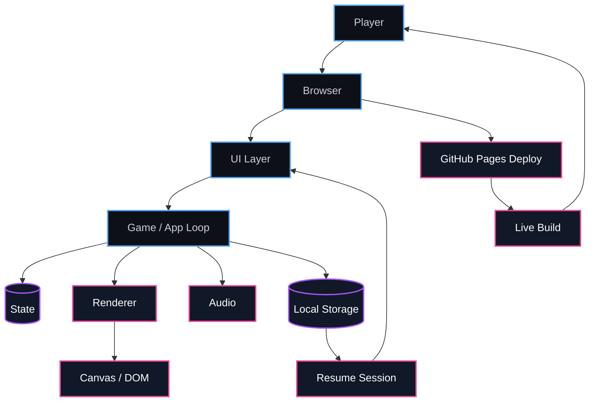

  

 

  

  

<table>
  <tr>
    <td align="center" width="33%">
      <h3>Build Style</h3>
      

        Small scope, clear assumptions, fast loops, readable structure.
      

    </td>
    <td align="center" width="33%">
      <h3>Game + Visuals</h3>
      

        Input feel, frame timing, state loops, canvas rendering.
      

    </td>
    <td align="center" width="33%">
      <h3>Web + Tools</h3>
      

        Practical UI, simple deployment, clean data flow, stable UX.
      

    </td>
  </tr>
</table>

<table>
  <tr>
    <td align="center" width="50%">
      
       
      
      
      
       
      Daily dashboard built for fast visibility and clean browser use.
    </td>
    <td align="center" width="50%">
      
       
      
      
      
       
      Browser text-to-speech queue tool for controlled playback.
    </td>
  </tr>
  <tr>
    <td align="center" colspan="2">
       
      
       
      
      
      
      
       
      Browser game project focused on simple interaction, responsive loops, and clean deployment.
    </td>
  </tr>
</table>

  

  

  

<table>
  <tr>
    <td align="center" width="25%">
      <b>Plan</b>
       
      Scope, constraints, core loop
    </td>
    <td align="center" width="25%">
      <b>Build</b>
       
      Readable modules, simple data flow
    </td>
    <td align="center" width="25%">
      <b>Ship</b>
       
      Static deploys, low-friction releases
    </td>
    <td align="center" width="25%">
      <b>Refine</b>
       
      Feedback, fixes, visual polish
    </td>
  </tr>
</table>

 

