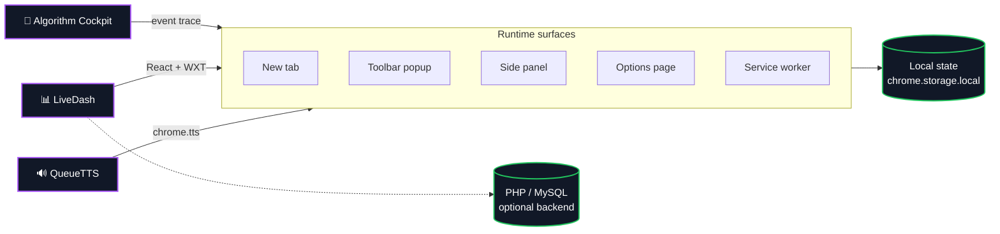

  

  

---

## About

I'm Mahan. I run GreenTouch, and most days I'm building something that lives inside a browser tab: a new tab page worth keeping open, a reading queue that talks back, a grid where you can watch A\* feel its way around walls. Computer science and AI are the throughline behind all of it.

The thing I keep optimizing for is whether a tool is useful the moment you open it, with your data sitting on your own machine instead of someone's server. That constraint shapes most of what I ship.

 

---

### 🧭 Algorithm Cockpit &nbsp;·&nbsp; <a href="https://mahan-imanian.github.io/ML-Algorithm-Visualizer/">Live Demo →</a>

Most algorithm visualizers play one animation and stop. This one records the whole run as an event trace you can replay. Draw walls and weighted terrain onto a grid, pick BFS, DFS, Dijkstra, or A\*, and step through the result one event at a time. Every visited cell, every node pushed to the frontier, every comparison and swap on the sorting side is its own frame.

Pause anywhere. Drag the scrubber back and forth across the timeline to line up two moments in the same run. The state panel and the highlighted pseudocode update right beside the grid as you go, and any run saves to local storage or exports as JSON. The whole thing is a single static page you can open straight from disk.

  
  
  
  

<table>
  <tr>
    <td width="50%" valign="top">
      <h3><a href="https://github.com/Mahan-Imanian/LiveDash">📊 LiveDash</a></h3>
      
LiveDash takes over the new tab page and fills it with the widgets you'd otherwise scatter across separate tabs: calendar, notes, todos, bookmarks, weather, news, a translator, and currency conversion.

      
The frontend is React and TypeScript with Tailwind, packaged into a Chrome MV3 extension through WXT and Workbox. Every widget keeps a local sample-data fallback, so the page still renders when the backend is offline. A Google sign-in flow and a PHP/MySQL backend starter are included for anyone hosting their own instance.

      

         
        
        
      

      

    </td>
    <td width="50%" valign="top">
      <h3><a href="https://github.com/Mahan-Imanian/QueueTTS">🔊 QueueTTS</a></h3>
      
Found something long you don't have time to read right now? QueueTTS grabs the selected text or the full article, lines it up in a queue, and reads it back through Chrome's speech engine whenever you're ready for it.

      
Capture runs off the right-click menu. The side panel manages the queue, and the options page covers voice, speed, and pronunciation. Queue and settings live in <code>chrome.storage.local</code>, and it targets Chrome 116 and up on Manifest V3.

      

         
        
        
      

      

    </td>
  </tr>
</table>

---

 

 

---

## How these are built

The three projects rhyme. Each one is a Chrome Manifest V3 surface set sitting on top of client-side state, with no backend it can't run without.

---

Open to collaboration on browser tooling and CS / AI work.

