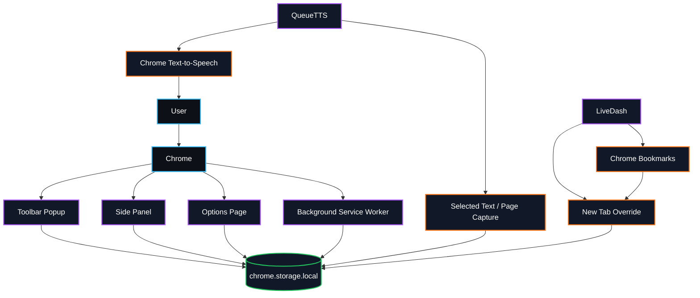

<div align="center">


<br><br>


<br><br>

<a href="https://github.com/Mahan-Imanian/QueueTTS">
  
</a>
<a href="https://github.com/Mahan-Imanian/LiveDash">
  
</a>
<a href="https://www.linkedin.com/in/mahan-imanian">
  
</a>

<br><br>


<br><br>


</div>

---

## What I build

I build browser tools that keep the main workflow close to the user: local storage, quick command surfaces, keyboard shortcuts, side panels, and extension pages that do one job without needing an account or backend.

Current public focus:

* Chrome Manifest V3 extensions
* Local-first browser state with `chrome.storage.local`
* Popup, side panel, options page, and new-tab interfaces
* Text capture, playback controls, dashboards, tasks, notes, bookmarks, and focus workflows

---

<div align="center">


</div>

<table>
  <tr>
    <td width="50%" valign="top">
      <h2>
        <a href="https://github.com/Mahan-Imanian/QueueTTS">QueueTTS</a>
      </h2>
      <p>
        Local-first Chrome extension for capturing browser text, queueing it, and listening later with Chrome text-to-speech.
      </p>
      <p>
        <b>Current version:</b> 2.4.0<br>
        <b>Chrome target:</b> Manifest V3, Chrome 116+<br>
        <b>Status:</b> source-first extension, load unpacked
      </p>
      <p>
        <a href="https://github.com/Mahan-Imanian/QueueTTS">
          
        </a>
      </p>
      <p>
        
        
        
      </p>
    </td>
    <td width="50%" valign="top">
      <h2>
        <a href="https://github.com/Mahan-Imanian/LiveDash">LiveDash</a>
      </h2>
      <p>
        Chrome new-tab dashboard for search, bookmarks, tasks, focus sessions, calendar context, notes, and quick links.
      </p>
      <p>
        <b>Current version:</b> 14.0.1<br>
        <b>Chrome target:</b> Manifest V3<br>
        <b>Status:</b> source-first extension, build/package scripts included
      </p>
      <p>
        <a href="https://github.com/Mahan-Imanian/LiveDash">
          
        </a>
      </p>
      <p>
        
        
        
      </p>
    </td>
  </tr>
</table>

---

## Project details

### QueueTTS

QueueTTS is built around one workflow: take text from the browser, keep it in a local queue, and play it back when the user is ready.

It includes:

* Popup command surface
* Side-panel queue
* Options page for voice and playback settings
* Context menus for selected text and current-page capture
* Chrome text-to-speech playback
* Local queue and settings storage
* Import/export and local privacy controls
* Keyboard shortcuts including command palette access

Development commands:

```bash
git clone https://github.com/Mahan-Imanian/QueueTTS.git
cd QueueTTS
npm install
npm run check
npm run build
```

Load unpacked:

```text
chrome://extensions → Developer mode → Load unpacked → select the QueueTTS folder
```

---

### LiveDash

LiveDash turns the Chrome new tab into a working dashboard instead of a blank landing page.

It includes:

* New-tab dashboard
* Popup quick actions
* Side-panel workflow
* Options/settings page
* Background service worker
* Local dashboard state through `chrome.storage.local`
* Bookmark-related features through Chrome bookmarks permission
* Build and package validation scripts

Development commands:

```bash
git clone https://github.com/Mahan-Imanian/LiveDash.git
cd LiveDash
npm install
npm run build
npm run package
```

Load unpacked:

```text
chrome://extensions → Developer mode → Load unpacked → select the LiveDash folder
```

---

<div align="center">


</div>



---

## Stack

<div align="center">


</div>

<br>

| Area               | Tools and APIs                                                        |
| ------------------ | --------------------------------------------------------------------- |
| Browser extensions | Manifest V3, service workers, popup pages, side panels, options pages |
| Browser state      | `chrome.storage.local`                                                |
| Browser APIs       | Chrome TTS, context menus, bookmarks, active tab, side panel          |
| Frontend           | HTML, CSS, JavaScript                                                 |
| Tooling            | Node.js scripts, repository validators, package checks                |
| Workflow           | Git, GitHub, VS Code                                                  |

---

<div align="center">


<br><br>


</div>

---

## Current limits

These projects are public source repositories, not polished product launches.

* Both projects are Chrome-focused.
* QueueTTS targets Chrome 116+.
* Install flow is currently load-unpacked from source.
* No public benchmark numbers are published.
* No Chrome Web Store listing is linked here.
* Screenshots and short demo GIFs should be added when available.

---

## Contact

<div align="center">

<a href="https://github.com/Mahan-Imanian">
  
</a>
<a href="https://www.linkedin.com/in/mahan-imanian">
  
</a>

<br><br>


</div>
