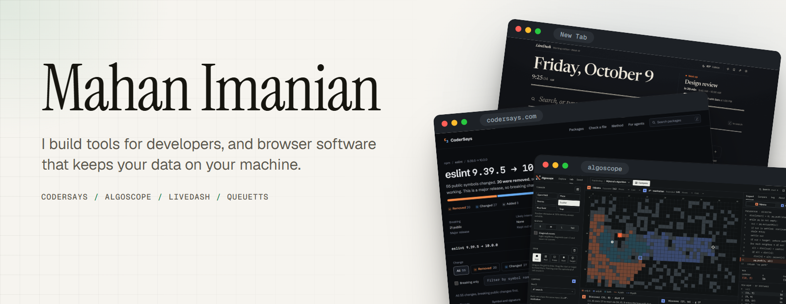
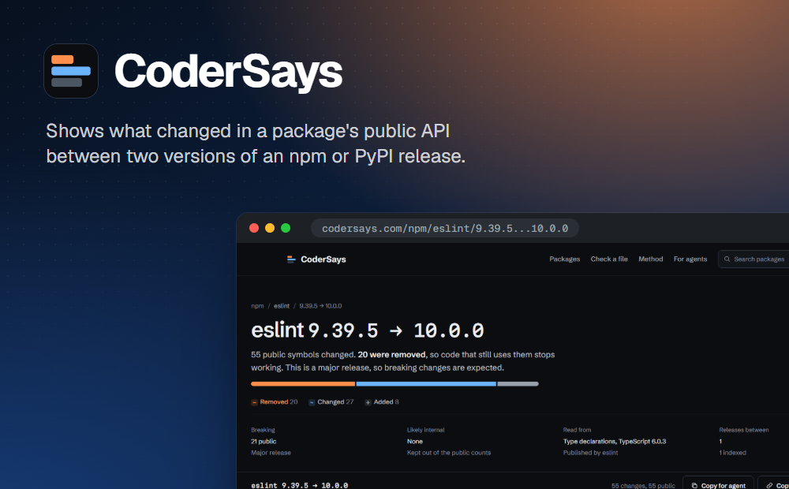
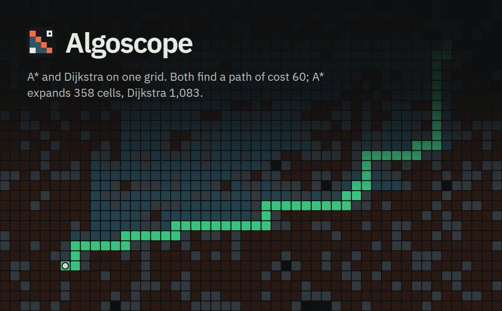
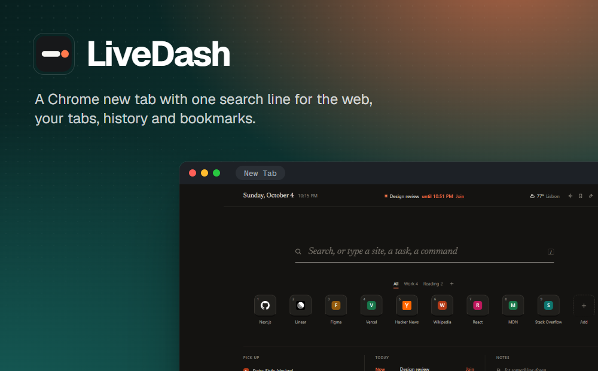
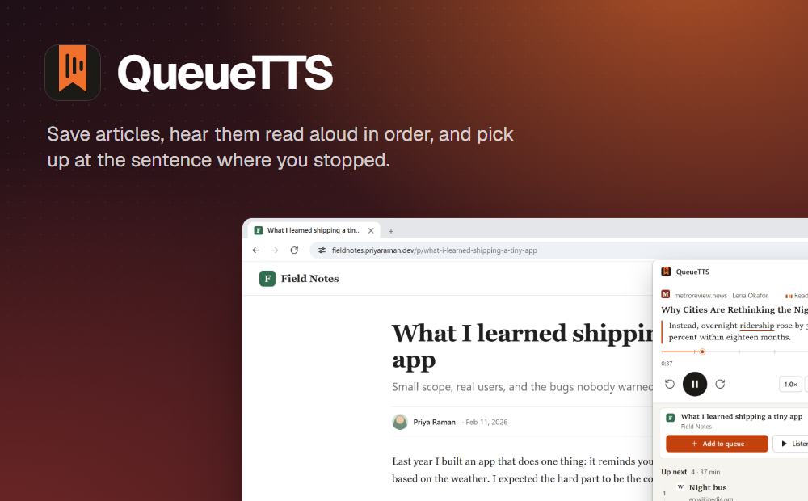

<picture>
  <source media="(prefers-color-scheme: dark)" srcset="assets/banner-dark.png">
  
</picture>

  
  
  

I'm Mahan, founder of GreenTouch, a cleantech startup. I study computer science and AI, have built websites for freelance clients since 2023, and made Roblox games before any of that. Most of what I ship now is developer tooling and software that runs in the browser.

## Projects

<table>
  <tr>
    <td width="50%" valign="top">
      
      <h3><a href="https://codersays.com">CoderSays</a></h3>
      
Pick two versions of an npm or PyPI package and see exactly which public functions, classes and types were added, removed or changed, read from the published package files. Each page is also served as JSON, so scripts and coding agents can query it.

      
<b>Live</b> · 335 comparisons across 18 packages · Laravel, TypeScript, Python · MCP server for agents in progress

    </td>
    <td width="50%" valign="top">
      
      <h3><a href="https://github.com/Mahan-Imanian/ML-Algorithm-Visualizer">Algoscope</a></h3>
      
An algorithm lab that records every operation and plays it back beside the queue, heap or call stack the algorithm is deciding from. Put two algorithms on the same input and it tells you how they differ, down to the first cell where they split.

      
<a href="https://mahan-imanian.github.io/ML-Algorithm-Visualizer/"><b>Live demo</b></a> · 18 algorithms, each tested against a reference implementation · React, TypeScript, Vite

    </td>
  </tr>
  <tr>
    <td width="50%" valign="top">
      
      <h3><a href="https://github.com/Mahan-Imanian/LiveDash">LiveDash</a></h3>
      
A Chrome new tab laid out like a front page: the date as the headline, your next meeting as the lead story with a countdown, and one search line that finds the tab you already have open before it searches the web. Every feature that goes online is opt-in.

      
Chrome extension · React, TypeScript, WXT · MIT

    </td>
    <td width="50%" valign="top">
      
      <h3><a href="https://github.com/Mahan-Imanian/QueueTTS">QueueTTS</a></h3>
      
A listen-later queue for the web. Save an article with one shortcut, and it's read aloud in order with the voices you already have, picking up at the sentence where you stopped, even after a restart.

      
Chrome extension · no host permissions · plain JavaScript · end-to-end tested in Chrome

    </td>
  </tr>
</table>

 

Open to collaboration on developer tools, browser software and CS / AI work · <a href="https://www.linkedin.com/in/mahan-imanian">LinkedIn</a>

