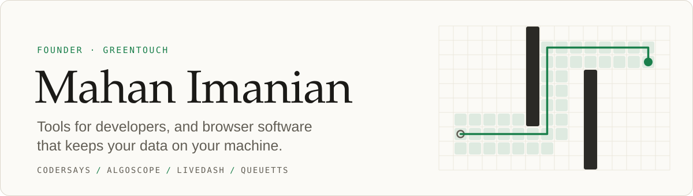

<picture>
  <source media="(prefers-color-scheme: dark)" srcset="assets/header-dark.svg">
  
</picture>

Founder of GreenTouch. I build tools for developers: an API diff checker for npm and PyPI, an algorithm lab, and browser extensions that keep your data on your machine.

I study computer science and AI<!-- TODO(mahan): university and program -->, have taken freelance web projects since 2023<!-- TODO(mahan): link 1–3 client sites you can name -->, and made Roblox games before any of this.<!-- TODO(mahan): game names + links, or cut this clause -->

### Now

- **[CoderSays](https://codersays.com)** — shows what actually changed in a package's public API between two versions, read from what npm and PyPI publish. Every page has a JSON twin. 335 comparisons across 18 packages so far; an MCP server for coding agents is next.
- **GreenTouch** — a cleantech startup I founded.<!-- TODO(mahan): one-line description + URL (greentouch-solutions.ir?) -->

### Selected work

- **[Algoscope](https://github.com/Mahan-Imanian/ML-Algorithm-Visualizer)** — an algorithm lab that records every step and replays it beside the queue, heap or call stack. 18 algorithms, two runs side by side with a verdict. [Try it live](https://mahan-imanian.github.io/ML-Algorithm-Visualizer/).
- **[LiveDash](https://github.com/Mahan-Imanian/LiveDash)** — a Chrome new tab with one search line for the web, your open tabs, history and bookmarks. Every network feature is opt-in.
- **[QueueTTS](https://github.com/Mahan-Imanian/QueueTTS)** — a listen-later queue that reads saved articles aloud and resumes at the sentence where you stopped. No host permissions.
- **Studio Agent** — a local control room that runs Claude Code against the place open in Roblox Studio, through Studio's built-in MCP server. Not public yet.

### Elsewhere

[LinkedIn](https://www.linkedin.com/in/mahan-imanian) · [codersays.com](https://codersays.com)<!-- TODO(mahan): add an email if you want one listed -->
